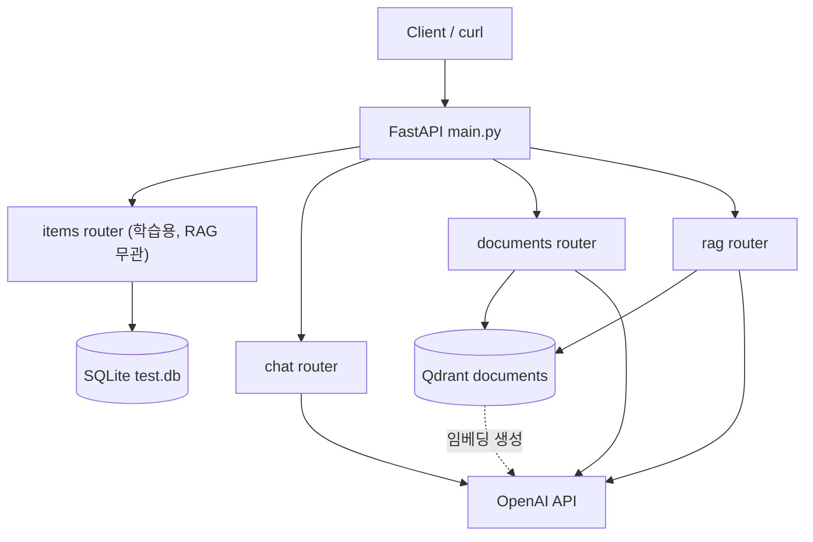
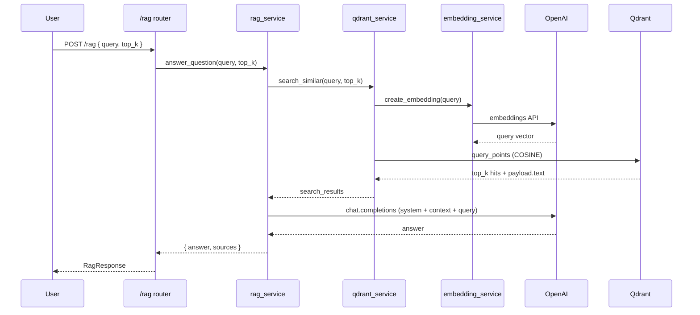

# RAG Chatbot (Python / FastAPI)

> Java/Spring Boot로 먼저 구현한 RAG 챗봇을 **Python/FastAPI**로 포팅한 학습·비교용 프로젝트입니다.

---

## 1. 프로젝트 개요

### 한 줄 설명

동일한 RAG 기능을 Java/Spring Boot에서 구현한 뒤, Python/FastAPI 생태계로 옮긴 **RAG 기반 Q&A 챗봇 API**입니다.

### 목적

- 두 언어/프레임워크(FastAPI vs Spring Boot)의 **구조·의존성 주입·레이어 분리** 차이를 체험
- OpenAI 임베딩·LLM과 Qdrant 벡터 DB를 연결한 **RAG 파이프라인**을 Python으로 재구현
- Java 버전과의 상세 비교는 **별도 문서**에서 다루며, 본 README는 **Python 버전만** 설명합니다.

### 핵심 기능 (RAG)

| 기능 | 설명 |
|------|------|
| **일반 채팅** | OpenAI `gpt-4o-mini` 단일 턴 대화 |
| **문서 인덱싱·검색** | 텍스트 임베딩 후 Qdrant에 저장·유사도 검색 |
| **RAG Q&A** | 검색된 문서를 컨텍스트로 LLM이 근거 기반 답변 + 출처 반환 |

> **`/items` 엔드포인트는 RAG와 무관합니다.**  
> FastAPI 라우팅·`Depends(get_db)`·SQLAlchemy CRUD를 익히기 위한 **학습용 부산물**이며, 문서·벡터·RAG 파이프라인과 데이터·로직이 전혀 연결되어 있지 않습니다. 포트폴리오에서 본 프로젝트의 본체는 `/documents`, `/rag`(및 `/chat`)입니다.

### 30초 요약

앱 기동 시 Qdrant `documents` 컬렉션을 자동 준비합니다. `POST /documents`로 문서를 넣으면 임베딩이 Qdrant에 저장되고, `POST /rag`로 질문하면 유사 문서를 검색한 뒤 `gpt-4o-mini`가 한국어로 답합니다. 같은 저장소에 남아 있는 `/items`·SQLite(`test.db`)는 **ORM 연습용**이므로 RAG 데모 시 무시해도 됩니다.

---

## 2. 기술 스택

### Python

- 권장: **Python 3.12+** (프로젝트에 `pyproject.toml` / `.python-version`은 없음)

### 주요 라이브러리 (requirements.txt 기준)

| 패키지 | 버전 | 용도 |
|--------|------|------|
| **fastapi** | 0.136.1 | REST API 프레임워크 |
| **uvicorn** | 0.47.0 | ASGI 서버 |
| **SQLAlchemy** | 2.0.49 | ORM (`/items` 학습용 SQLite만 사용, RAG 무관) |
| **pydantic** | 2.13.4 | 요청/응답 스키마 |
| **openai** | 2.37.0 | 임베딩·채팅 API |
| **qdrant-client** | 1.18.0 | 벡터 DB 클라이언트 |
| **python-dotenv** | 1.2.2 | `.env` 환경 변수 로드 |
| **httpx** | 0.28.1 | OpenAI SDK HTTP 클라이언트 |

### 외부 서비스

| 서비스 | 역할 |
|--------|------|
| **OpenAI API** | `text-embedding-3-small` 임베딩, `gpt-4o-mini` 채팅·RAG 생성 |
| **Qdrant** | 문서 벡터 저장·코사인 유사도 검색 (`localhost:6333`) |

---

## 3. 아키텍처

### 시스템 구성도



### RAG 파이프라인 흐름도



**문서 적재 시** (`POST /documents`): `text` → 임베딩 → Qdrant `upsert` (payload에 원문 `text` 저장).

---

## 4. 프로젝트 구조

```
python-test/
├── main.py                 # FastAPI 앱, 라우터 등록, DB·Qdrant 초기화
├── requirements.txt
├── README.md
└── app/
    ├── config.py           # OPENAI_API_KEY (.env)
    ├── database.py         # SQLite ( /items 전용, RAG 무관 )
    ├── entities.py         # Item 엔티티 (학습용)
    ├── models.py           # Item Pydantic 스키마 (학습용)
    ├── routers/
    │   ├── items.py        # FastAPI+SQLAlchemy CRUD 연습 (RAG 무관)
    │   ├── chat.py         # 단순 LLM 채팅
    │   ├── documents.py    # 문서 추가·벡터 검색
    │   └── rag.py          # RAG 질의응답
    └── services/
        ├── embedding_service.py  # OpenAI 임베딩
        ├── openai_service.py     # 단순 채팅
        ├── qdrant_service.py     # 컬렉션·저장·검색
        └── rag_service.py        # 검색 + LLM 답변
```

### 모듈 역할

| 경로 | 역할 |
|------|------|
| `main.py` | 앱 진입점, Qdrant 초기화 + (`/items`용) SQLite 테이블 생성, 라우터 마운트 |
| `app/config.py` | `load_dotenv()`, `OPENAI_API_KEY` 필수 검증 |
| `app/database.py` | SQLite·세션 DI — **`/items` 전용**, RAG·Qdrant와 무관 |
| `app/entities.py` | `items` 테이블 엔티티 — **학습용 부산물** |
| `app/models.py` | Item 요청/응답 스키마 — **학습용 부산물** |
| `app/routers/items.py` | REST CRUD 연습 — **RAG 파이프라인에 미참여** |
| `app/routers/*` | HTTP 엔드포인트·요청/응답 모델 |
| `app/services/embedding_service.py` | `text-embedding-3-small`, 1536차원 벡터 생성 |
| `app/services/openai_service.py` | 사용자 메시지 1회 `gpt-4o-mini` 호출 |
| `app/services/qdrant_service.py` | 컬렉션 생성, 문서 upsert, 유사도 검색 |
| `app/services/rag_service.py` | 검색 → 컨텍스트 조립 → 시스템 프롬프트 기반 답변 |

---

## 5. 주요 기능

### API 엔드포인트

#### RAG·챗봇 (본 프로젝트)

| Method | Path | 설명 |
|--------|------|------|
| `GET` | `/` | 헬스/확인용 `{"message": "Hello"}` |
| `POST` | `/chat` | OpenAI 단순 채팅 (`message` → `response`) |
| `POST` | `/documents` | 문서 텍스트 임베딩 후 Qdrant 저장 (`id`, `text`) |
| `POST` | `/documents/search` | 쿼리 임베딩으로 유사 문서 Top-K 검색 |
| `POST` | `/rag` | RAG: 유사 문서 검색 후 LLM 답변 + `sources` |

#### `/items` — FastAPI·SQLAlchemy 학습용 (RAG 무관)

아래 5개 엔드포인트는 **같은 앱에 묶여 있을 뿐**, RAG·문서 인덱싱·Qdrant·OpenAI 파이프라인과 **코드·데이터 모두 분리**되어 있습니다. 제거해도 RAG 동작에는 영향이 없습니다.

| Method | Path | 설명 |
|--------|------|------|
| `GET` | `/items` | 전체 Item 목록 조회 |
| `GET` | `/items/{item_id}` | ID로 Item 단건 조회 (없으면 404) |
| `POST` | `/items` | Item 생성 (`name`, `price`) |
| `PUT` | `/items/{item_id}` | Item 수정 (없으면 404) |
| `DELETE` | `/items/{item_id}` | Item 삭제, `{"deleted": id}` 반환 |

### 엔드포인트 동작 요약

**RAG·챗봇**

- **`POST /chat`**: `openai_service.chat` — 시스템 프롬프트 없이 사용자 메시지만 전달.
- **`POST /documents`**: `qdrant_service.add_document` — 전체 `text` 한 번에 임베딩·`upsert` (동일 `id`는 덮어씀).
- **`POST /documents/search`**: 쿼리 벡터로 코사인 유사도 검색, `id`·`score`·`text` 리스트 반환 (기본 `top_k=5`).
- **`POST /rag`**: `top_k`개 문서를 컨텍스트로 묶어 시스템 규칙(문서 근거·한국어·모르면 명시) 하에 답변, 사용한 문서를 `sources`에 포함 (기본 `top_k=3`).

**`/items` (학습용, RAG 무관)**

- **`GET /items`**, **`GET /items/{id}`**: SQLAlchemy 세션으로 `items` 테이블만 조회 (Qdrant·임베딩 미사용).
- **`POST /items`**: SQLite에 행 추가 — RAG 문서 저장과 무관.
- **`PUT /items/{id}`**, **`DELETE /items/{id}`**: 전형적인 CRUD 연습용.

대화형 API 스키마는 실행 후 **http://127.0.0.1:8000/docs** (Swagger UI)에서 확인할 수 있습니다. Swagger에 `/items`가 보여도 **RAG 데모 필수 API는 아닙니다.**


---

## 6. 실행 방법

### 사전 요구사항

- **Python 3.12** (또는 3.11+)
- **Docker** (Qdrant 로컬 실행)
- **OpenAI API Key**

### 1) 가상환경 및 패키지 설치

```bash
cd python-test
python -m venv venv

# Windows
venv\Scripts\activate

# macOS / Linux
source venv/bin/activate

pip install -r requirements.txt
```

### 2) Qdrant 실행 (Docker)

```bash
docker run -p 6333:6333 -p 6334:6334 ^
  -v "%cd%\qdrant_storage:/qdrant/storage" ^
  qdrant/qdrant
```

macOS / Linux:

```bash
docker run -p 6333:6333 -p 6334:6334 \
  -v "$(pwd)/qdrant_storage:/qdrant/storage" \
  qdrant/qdrant
```

앱 기동 시 `documents` 컬렉션이 없으면 **1536차원·COSINE** 설정으로 자동 생성됩니다.  
(이때 SQLite `test.db`도 함께 생길 수 있으나, **`/items` 학습용**이며 RAG·Qdrant 실행에는 불필요합니다.)

### 3) 환경 변수 (`.env`)

프로젝트 루트에 `.env` 파일을 생성합니다 (`config.py`가 로드하며, 키가 없으면 앱이 시작되지 않습니다).

```env
OPENAI_API_KEY=sk-your-key-here
```

| 변수 | 필수 | 설명 |
|------|------|------|
| `OPENAI_API_KEY` | O | OpenAI API 인증 키 |

Qdrant는 코드상 `host=localhost`, `port=6333`으로 고정되어 있습니다.

### 4) 서버 실행

```bash
uvicorn main:app --reload
```

- API: http://127.0.0.1:8000  
- Swagger: http://127.0.0.1:8000/docs  

첫 실행 시 **`test.db`** 가 생성될 수 있습니다 (`/items` 전용, RAG 데모에는 불필요).

### 5) API 호출 예시 (curl)

**문서 등록**

```bash
curl -X POST http://127.0.0.1:8000/documents ^
  -H "Content-Type: application/json" ^
  -d "{\"id\": 1, \"text\": \"FastAPI는 Python ASGI 웹 프레임워크입니다.\"}"
```

**벡터 검색**

```bash
curl -X POST http://127.0.0.1:8000/documents/search ^
  -H "Content-Type: application/json" ^
  -d "{\"query\": \"웹 프레임워크\", \"top_k\": 3}"
```

**RAG 질의**

```bash
curl -X POST http://127.0.0.1:8000/rag ^
  -H "Content-Type: application/json" ^
  -d "{\"query\": \"FastAPI가 뭐야?\", \"top_k\": 3}"
```

**단순 채팅**

```bash
curl -X POST http://127.0.0.1:8000/chat ^
  -H "Content-Type: application/json" ^
  -d "{\"message\": \"안녕하세요\"}"
```

**`/items` (선택) — SQLAlchemy CRUD 연습용, RAG와 무관**

```bash
curl -X POST http://127.0.0.1:8000/items ^
  -H "Content-Type: application/json" ^
  -d "{\"name\": \"노트북\", \"price\": 1200000}"
```

---

## 7. 핵심 의사결정

코드 기준으로 정리한 설계 선택입니다.

### 임베딩 모델: `text-embedding-3-small` (1536차원)

```9:10:app/services/embedding_service.py
EMBEDDING_MODEL = "text-embedding-3-small"
EMBEDDING_DIMENSION = 1536  # 이 모델의 벡터 차원
```

- 비용·지연·품질 균형이 좋은 소형 임베딩 모델
- Qdrant 컬렉션 `VectorParams.size`와 **반드시 일치**해야 함 (`init_collection`에서 1536 사용)

### LLM: `gpt-4o-mini`

- `openai_service`(일반 채팅)와 `rag_service`(근거 기반 답변) 모두 동일 모델

### 시스템 프롬프트 설계 (환각 방지)

RAG 답변은 `rag_service`에서 **시스템 메시지**로 규칙을 고정합니다. 문서 밖 지식을 끌어오지 말 것, 근거가 없으면 추측하지 말 것, 한국어·간결 응답을 명시합니다.

```10:16:app/services/rag_service.py
SYSTEM_PROMPT = """당신은 주어진 문서를 기반으로 사용자 질문에 답하는 어시스턴트입니다.

규칙:
1. 반드시 제공된 문서 내용을 근거로 답변하세요.
2. 문서에 없는 내용은 추측하지 말고 "제공된 문서에서 해당 정보를 찾을 수 없습니다"라고 답하세요.
3. 답변은 간결하게 한국어로 작성하세요.
"""
```

- **환각 방지 검증 (수동)**: 인덱싱되지 않은 주제로 `POST /rag`를 호출했을 때, 임의 추측보다 규칙 2에 따른 **“제공된 문서에서 해당 정보를 찾을 수 없습니다”** 응답이 나오는 경우를 확인했습니다 (프롬프트만으로 완전 차단은 어렵고, 검색 품질·컨텍스트 노이즈에 따라 여전히 환각 가능).

### 청크 전략: **미적용 (문서 단위 1벡터)**

현재 구현은 **문서를 쪼개지 않고** `POST /documents`의 `text` 전체를 한 번 임베딩합니다.

- `doc_id`당 Qdrant 포인트 1개 (`PointStruct.id = doc_id`)
- 긴 문서는 단일 벡터에 정보가 압축되어 검색 품질이 떨어질 수 있음 → 학습 단계에서는 단순화, 이후 청킹·오버랩·메타데이터 확장 여지

### 벡터 검색: Qdrant + 코사인 거리

```20:25:app/services/qdrant_service.py
        client.create_collection(
            collection_name=COLLECTION_NAME,
            vectors_config=VectorParams(
                size=EMBEDDING_DIMENSION,
                distance=Distance.COSINE,
            ),
```

- OpenAI 임베딩은 보통 **정규화된 코사인 유사도**와 잘 맞음
- 검색 API는 `query_points`로 쿼리 벡터와 Top-K 반환

### RAG 컨텍스트 조립

- 검색 결과 `payload["text"]`를 `[문서 N]` 형태로 이어 붙인 뒤 사용자 질문과 함께 전달
- 응답에 **원문 검색 결과(`sources`)** 를 함께 반환해 출처 추적 가능

### 관계형 DB: SQLite — `/items` 전용 (RAG 무관)

```5:5:app/database.py
SQLALCHEMY_DATABASE_URL = "sqlite:///./test.db"
```

- **`/items` 엔드포인트를 위한 학습용 부산물** — RAG·문서 검색에는 사용하지 않음
- 별도 DB 서버 없이 FastAPI + SQLAlchemy CRUD·`Depends(get_db)` 패턴 연습
- `check_same_thread=False`로 SQLite + FastAPI 동시 접근 허용
- RAG·문서 데이터는 **Qdrant만** 사용 (`test.db`와 완전 분리)

### 앱 시작 시 초기화

```8:12:main.py
Base.metadata.create_all(bind=engine)
# ...
qdrant_service.init_collection()
```

- Spring의 `ddl-auto` / 스키마 초기화에 대응하는 **테이블·컬렉션 자동 준비**
- 운영 환경에서는 마이그레이션 도구(Alembic 등) 분리 권장

### 설정·보안

- API 키는 `.env` + `python-dotenv`, 저장소에 `.env`는 **gitignore**
- `config.py`에서 키 누락 시 **즉시 `ValueError`** 로 실패 (조용한 빈 키 방지)

---

## 8. 트러블슈팅

개발·실행 중 실제로 겪은 이슈입니다.

### 8.1 가상환경 격리

| 문제 | 원인 | 해결 |
|------|------|------|
| `pip install -r requirements.txt` 후에도 import 오류·버전 불일치 | **venv 미활성화** 상태에서 설치 → 패키지가 **시스템(전역) Python**에 들어감 | 프로젝트 루트에서 `python -m venv venv` 생성 후 `venv\Scripts\activate`(Windows) / `source venv/bin/activate`(macOS·Linux) → **활성화된 터미널**에서 `pip install` 재실행 |
| `which python` / `where python`이 프로젝트 `venv`가 아님 | 셸이 전역 Python을 가리킴 | 활성화 후 `python -m pip install -r requirements.txt`로 **같은 인터프리터**에 설치 |

### 8.2 qdrant-client API 변경 (`search` → `query_points`)

| 문제 | 원인 | 해결 |
|------|------|------|
| 문서 검색·RAG 호출 시 `AttributeError: 'QdrantClient' object has no attribute 'search'` (또는 유사 오류) | **qdrant-client 1.x**에서 검색 API가 변경됨. 예전 튜토리얼·Java 클라이언트 패턴의 `client.search(...)`는 현재 클라이언트에 없음 | `app/services/qdrant_service.py`의 `search_similar`를 **`client.query_points(collection_name=..., query=query_vector, limit=top_k).points`** 로 수정 |
| 검색 결과 파싱 오류 | 반환 타입이 리스트가 아니라 **`.points`** 속성에 담김 | `for hit in results` 대신 `for hit in client.query_points(...).points` 로 순회 |

### 8.3 uvicorn 좀비 프로세스 (포트 8000 중복)

| 문제 | 원인 | 해결 |
|------|------|------|
| `uvicorn main:app` 실행 시 **Address already in use** / 포트 8000 점유 | 이전 `uvicorn --reload` 자식 프로세스가 종료되지 않고 **좀비로 남음** (터미널 강제 종료, IDE 중단 등) | Windows: `netstat -ano`로 PID 확인 후 `findstr :8000` → `taskkill /PID <pid> /F` |
| `--reload` 후에도 이전 서버가 살아 있음 | 파일 감시 프로세스·부모/자식 uvicorn이 분리되어 정리 안 됨 | 모든 uvicorn/python 프로세스 종료 후 재기동, 또는 다른 포트: `uvicorn main:app --port 8001` |

---

## 9. 한계 및 개선 방향

| 한계 | 현황 | 개선 방향 |
|------|------|-----------|
| **청킹 미적용** | 문서 전체를 1벡터로 임베딩·저장 | 청크 분할(예: 500자, overlap 50), 청크별 메타데이터·ID 전략 |
| **Hybrid 검색 미적용** | Dense(임베딩) 유사도만 사용 | Sparse(BM25 등) + Dense 결합, Java 버전과 동일한 Hybrid 실험 |
| **평가 자동화 부재** | 수동 curl·눈으로만 품질 확인 | 평가셋, Hit@K / MRR, RAGAS 등 메트릭 파이프라인 |
| **async 미적용** | 동기 `def` + 블로킹 OpenAI·Qdrant 호출 | `async def`, `AsyncOpenAI`, 비동기 Qdrant 클라이언트로 동시 요청 처리 |
| **인증·멀티테넌시 없음** | API 키·사용자 구분 없이 공개 | API Key / JWT, 테넌트·컬렉션·문서 payload 격리 |

---

## 관련 링크

- [FastAPI 문서](https://fastapi.tiangolo.com/)
- [Qdrant 문서](https://qdrant.tech/documentation/)
- [OpenAI API 문서](https://platform.openai.com/docs)

---

*Java/Spring Boot 버전과의 프레임워크·레이어 비교는 별도 비교 문서에서 다룹니다.*

---

## 10. 회고

### 잘 한 점
- Java 버전을 먼저 만들어둔 덕분에 Python 포팅 시 비즈니스 로직 고민 없이 **언어/프레임워크 차이에만 집중** 가능했음
- `/items` 등 학습용 부산물도 숨기지 않고 README에 명시하여 솔직성 유지

### 아쉬운 점
- Java 버전에서 검증한 **청크 500자·Hybrid 검색·실험 기반 의사결정**을 Python 버전에선 시간 제약으로 적용 못 함
- 평가 자동화 없이 수동 검증만 수행
- 비동기(`async`) 처리 미적용

### Java → Python 포팅에서 체감한 차이
- **코드 분량**: 동일 기능 구현 시 Python이 명확히 짧음. 예: `@Configuration` + `@Bean` + `@Autowired` 조합이 Python에선 `Depends(get_db)` 한 줄로 처리
- **DI 방식**: Spring은 클래스 멤버 주입, FastAPI는 함수 인자 주입 → 후자가 더 명시적이고 테스트하기 좋다고 느낌
- **타입 안정성**: Python의 타입 힌트는 강제력이 없음 (런타임에 가서야 에러 발견). 대규모 프로젝트에선 Java/Kotlin의 정적 타입 검사가 더 안전하다는 일반론을 직접 체감해보고 싶음

### 다음에 한다면
- 청킹·Hybrid 검색 도입
- 평가셋 + RAGAS 자동 평가
- `async def` 전환으로 동시성 개선